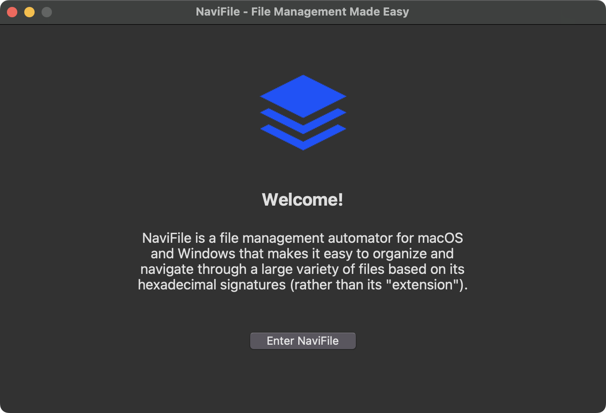
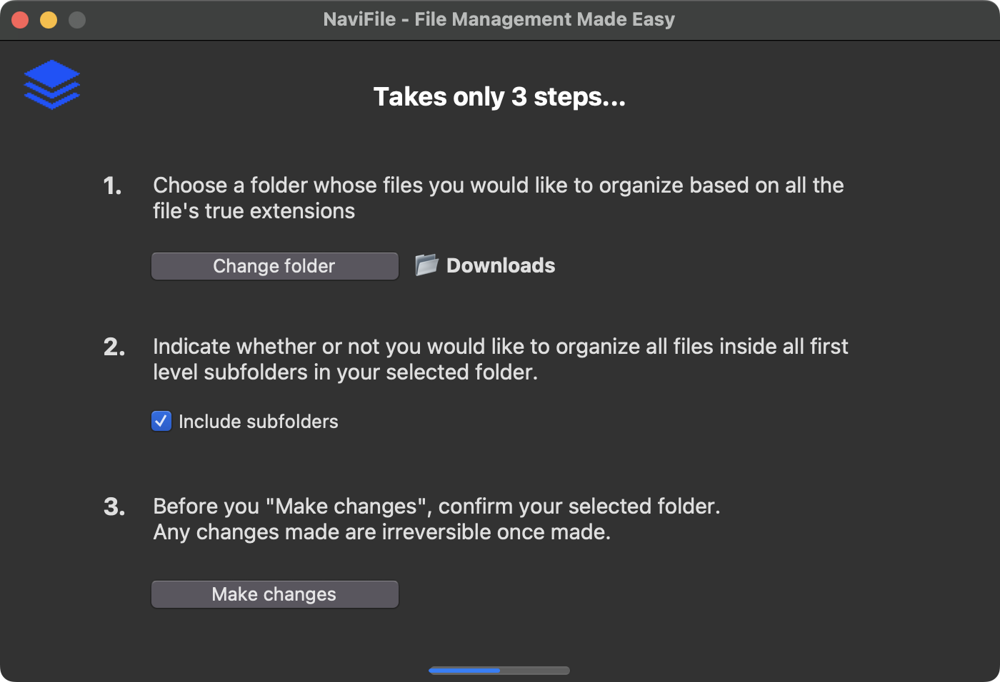

  
  <h1 align="center">NaviFile</h1>

## What is NaviFile?
NaviFile is a file management automator for macOS and Windows that makes it easy to organize and navigate 
through a large variety of files based on its hexadecimal signatures (rather than its "extension").

Built with Tkinter and deployed with Pyinstaller.

## Screenshots

### Home Page

### Main Page

